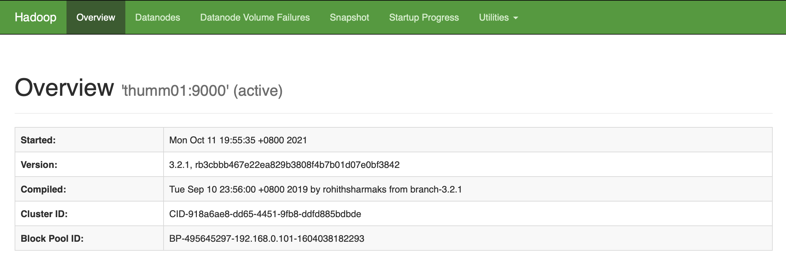
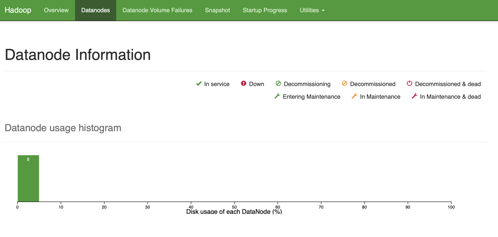
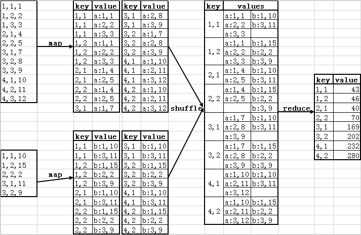

# 实验二 DFS 与 MapReduce
<div style="text-align: center;">
    
</div>

## 〇、服务器集群说明

### 1. 可使用的服务器集群

集群一：ip地址： 10.103.9.11 ，可用机器：01，02，03，04。登录集群一01的命令： ssh
xxx@10.103.9.11 （也就是和以下实验指导书的内容完全相同）
集群二：ip地址： 10.103.10.156 ，可用机器：01-04。登录集群二01的命令： ssh
xxx@10.103.10.156 -p 8001 (由于进入该集群的端口并非默认端口，所以在 ssh 指令后面一定要用 -p 要加上端口号！)
其中 xxx为学号，默认密码也为学号。

### 2. 注意事项

#### 2.1 集群二的ssh连接端口和内部节点ip改变的问题
前面我们提到，集群二ssh所使用的端口为8001，而并非默认端口22，所以在使用 ssh 进入集群二时需要在最后添加 -p 8001 。此外，集群二节点之间的内部ip地址与集群一节点之间的内部ip地址也不同。

在集群一当中， thumm0X 的内部ip为 ```192.168.0.10X``` （X为1到4）
在集群二当中， thumm0X 的内部ip为 ```192.168.1.10X``` （X为1到4）

所以后续实验指导书中，涉及到集群的ssh连接端口以及集群节点内部ip的内容，在使用集群二的时候都需要进行对应修改（因为实验指导书默认使用的均为集群一）。
举例：在本次实验指导书中的 “三、掌握Hadoop DFS常用指令”-“2. 通过Web 查看Hadoop 运行情况”，提到需要在本地运行命令 ssh xxx@10.103.9.11 -L 9870:192.168.0.101:9870 （其中xxx为学号），那么放在集群二当中，则需要运行 ssh xxx@10.103.10.156 -p 8001 -L 9870:192.168.1.101:9870 才能看到对应的结果。后续再有类似情况均进行类似处理。

#### 2.2 集群节点更新通知
此后我们将随时在课程群中通知类似于某个集群/某个集群节点需要停用/启用的通知，请同学们及时在课程群查收消息，并在必要时更换集群继续进行实验。当实验中出现任何故障（例如无法登录、无法进行文件读写），请及时在课程群内告知我们。我们会尽快进行问题的排查与集群节点的修复。

## 一、实验目标

本次实验旨在补全一个简单的Distributed File System (DFS) 并在其上实现MapReduce框架。具体任务如下：

* 了解 Hadoop 分布式文件系统常用指令（1 分）；
* 补全一个简单的分布式文件系统，并实现多副本与 HeartBeat 容错功能（9 分）；
* 在自己设计的分布式文件系统上实现MapReduce 框架（5 分）。

## 二、实验任务与要求

* Hadoop

  * 掌握Hadoop简单指令，包括文件传输、查看

  * 通过Web 查看Hadoop 运行情况

* 分布式文件系统

  * 根据给定copyFromLocal代码，补充copyToLocal、ls、rm代码，实现分布式文件系统中下载、查看、删除

  * 实现 mkdir、mv 接口，支持在 NameNode 中创建目录和移动/重命名路径

  * 实现数据块多副本功能，对数据块进行多节点存储

  * 实现 HeartBeat 功能，支持周期心跳、死亡判定以及失联节点副本的自动补全

* MapReduce
  
  * 实现矩阵乘法计算的MapReduce框架
  
  * Bonus——实现 Worker 失败重跑，或实现副本再平衡 / 写流水线等 GFS 风格优化
  
* 报告提交要求

  * 将命令、关键代码（文本）、结果截图放入报告，实验报告需为pdf 格式，连同代码文件一同打包成压缩文件（命名为`学号_姓名_实验二.*`，例如：`2021200000_张三_实验二.zip`），最后提交到网络学堂。压缩文件中文件目录应为：

    ```
    .
    └── 学号_姓名_实验二.pdf
    └── MyDFS
        └── client.py
        └── common.py
        └── ...
    ```


  * 迟交作业一周以内，以50% 比例计分；一周以上不再计分。一经发现抄袭情况（包括往届），零分处理。

## 三、掌握Hadoop DFS常用指令

### 1. Hadoop使用方法

在服务器上，我们通过Linux 指令对本地文件系统进行操作，如使用`ls` 查看文件/目录信息、使用`cp` 进行文件复制、使用`cat` 查看文件内容。在分布式文件系统中，也有一套相似的指令，接下来我们需要掌握一些基本的指令。（本题 1 分）

首先查看Hadoop DFS 支持的指令：

```bash
2020214210@thumm01:~$ hadoop fs
Usage: hadoop fs [generic options]
[-cat [-ignoreCrc] <src > ...]
[-copyFromLocal [-f] [-p] [-l] [-d] [-t <thread count >] <localsrc > ... <dst >]
[-copyToLocal [-f] [-p] [-ignoreCrc] [-crc] <src > ... <localdst >]
[-cp [-f] [-p | -p[topax]] [-d] <src > ... <dst >]
[-head <file >]
[-help [cmd ...]]
[-ls [-C] [-d] [-h] [-q] [-R] [-t] [-S] [-r] [-u] [-e] [<path > ...]]
[-mkdir [-p] <path > ...]
[-moveFromLocal <localsrc > ... <dst >]
[-moveToLocal <src > <localdst >]
[-mv <src > ... <dst >]
[-rm [-f] [-r|-R] [-skipTrash] [-safely] <src > ...]
[-rmdir [--ignore -fail -on-non -empty] <dir > ...]
......
```

上面是DFS 中常用的指令，这些指令中有一些我们在本地文件系统中也用过，如`ls、cp、mv、rm、mkdir、cat、head`，还有一些指令是DFS 特有的，例如`copyFromLocal`、`copyToLocal`，主要用于DFS 与本地文件系统的数据交换。接下来使用`ls` 指令查看DFS 中根目录下文件/文件夹的信息：

```bash
2020214210@thumm01:~$ hadoop fs -ls /
Found 2 items
drwxr-xr-x   - root  supergroup          0 2021-10-05 12:42 /dsjxtjc
drwxrwxrwx   - jtliu supergroup          0 2020-12-21 23:25 /tmp
```

可以看到，现在DFS 根目录下一共有两项。其中`dsjxtjc` 是一个文件夹，在这个文件夹下面有每位同学的文件夹，例如某位同学的学号是`202121xxxx`，那么TA对应的文件夹为`/dsjxtjc/202121xxxx/`。为了保证实验过程中不同用户之间不会产生干扰，每位同学只能在自己的文件夹下进行操作。下面查看自己文件夹下的内容：

```bash
2020214210@thumm01:~$ hadoop fs -ls /dsjxtjc/2020214210
2020214210@thumm01:~$
```

接下来在本地创建一个`test.txt` 文件：

```bash
2020214210@thumm01:~$ touch test.txt
2020214210@thumm01:~$ echo "Hello Hadoop" > test.txt
2020214210@thumm01:~$ cat test.txt
Hello Hadoop
2020214210@thumm01:~$
```

将本地文件传输至DFS 中：

```bash
2020214210@thumm01:~$ hadoop fs -copyFromLocal ./test.txt /dsjxtjc/2020214210/
2021-10-11 20:15:04,136 INFO sasl.SaslDataTransferClient: SASL encryption trust check: localHostTrusted = false, remoteHostTrusted = false
2020214210@thumm01:~$ hadoop fs -cat /dsjxtjc/2020214210/test.txt
2021-10-11 20:15:26,045 INFO sasl.SaslDataTransferClient: SASL encryption trust check: localHostTrusted = false, remoteHostTrusted = false
Hello Hadoop
```

可以看到文件已经传输到DFS 上。`copyFromLocal/copyToLocal `用于本地文件系统与DFS之间文件的复制，`moveFromLocal/moveToLocal` 用于本地文件系统与DFS 之间文件的移动，这些指令的详细用法可以使用`-help` 指令查看，例如我们想了解`copyFromLocal `的用法：

```bash
2020214210@thumm01:~$ hadoop fs -help copyFromLocal
-copyFromLocal [-f] [-p] [-l] [-d] [-t <thread count>] <localsrc> ... <dst> :
  Copy files from the local file system into fs. Copying fails if the file already
  exists, unless the -f flag is given.
  Flags:

  -p                 Preserves access and modification times, ownership and the
                     mode.
  -f                 Overwrites the destination if it already exists.
  -t <thread count>  Number of threads to be used, default is 1.
  -l                 Allow DataNode to lazily persist the file to disk. Forces
                     replication factor of 1. This flag will result in reduced
                     durability. Use with care.
  -d                 Skip creation of temporary file(<dst>._COPYING_).
```

可以看到该指令有两个必填参数，第一个参数是本地路径，第二个参数是DFS 路径。

### 2. 通过Web 查看Hadoop 运行情况

在**<u>本地</u>**运行如下命令（将服务器的9870 端口映射到本地的9870 端口）：

```bash
ssh xxx@10.103.9.11 -L 9870:192.168.0.101:9870
Welcome to Ubuntu 16.04.6 LTS (GNU/Linux 4.4.0-210-generic x86_64)
...
xxx@thumm01:~$ 
```

在本地的浏览器中输入`localhost:9870` 打开9870 端口，即可查看hadoop 运行情况，可通过此界面查看hadoop 的一些基本参数和job/task 的完成情况。



<center>图1 Overview</center>



<center>图2 DataNode Information</center>

## 四、分布式文件系统

GFS由一个`master`、多个`chunkserver`组成；用户通过`client`与GFS交互。以下用`NameNode`表示`master`，`DataNode`表示`chunkserver`。文件夹`MyDFS`中实现了一个简单的分布式文件系统，包含了NameNode、DataNode、Client三部分，其中NameNode负责记录文件块的位置（FAT表），DataNode负责数据的存储与读取，而Client则是用户与分布式文件系统交互的接口，详细原理请参考理论课内容和相关论文。（建议大家结合论文`The Google File System`或网上关于GFS的讲解来做这道题）

请根据提示和题设补全、修改代码，保证系统能完成以下指令：

- ls <dfs_path> : 显示当前目录/文件信息
- mkdir <dfs_path> : 在DFS中创建目录
- mv <src_path> <dst_path> : 移动或重命名DFS中的路径
- copyFromLocal <local_path> <dfs_path> : 从本地复制文件到DFS
- copyToLocal <dfs_path> <local_path> : 从DFS复制文件到本地
- rm <dfs_path> : 删除DFS上的文件
- format : 格式化DFS

本部分共 9 分：copyToLocal 1.5 分，ls 1 分，rm 1.5 分，mkdir/mv 1 分，多副本 2 分，HeartBeat 与自动补副本 2 分。

### 0. MyDFS信息

#### 0.0 目录结构

starter 中的 `MyDFS` 目录如下（`dfs/name`、`dfs/data` 在首次运行 NameNode/DataNode 或执行 `format` 时创建）：

- MyDFS : 根目录
  - test.txt : 测试样例
  - common.py : 全局变量
  - name_node.py : NameNode程序
  - data_node.py : DataNode程序
  - client.py : Client程序，用于用户与DFS交互
  - dfs : 运行时生成，用于模拟DFS文件系统
    - name : 存放NameNode数据
    - data : 存放DataNode数据

#### 0.1 模块功能

- name_node.py
  - 保存文件的块存放位置信息
  - 获取文件/目录信息
  - get_fat_item： 获取文件的FAT表项
  - new_fat_item： 根据文件大小创建FAT表项
  - rm_fat_item： 删除一个FAT表项
  - mkdir / mv：在NameNode中创建目录、移动或重命名路径
  - HeartBeat：检测DataNode状态，并在节点失联后触发副本修复
  - format: 删除所有FAT表项

- data_node.py
  - load 加载数据块
  - store 保存数据块
  - rm 删除数据块
  - heartbeat 返回DataNode存活状态
  - list_blocks / report_blocks 上报当前节点保存的数据块
  - format 删除所有数据块

- client.py
  - ls : 查看当前目录文件/目录信息
  - mkdir ：创建DFS目录
  - mv ：移动或重命名DFS路径
  - copyFromLocal : 从本地复制数据到DFS
  - copyToLocal ： 从DFS复制数据到本地
  - rm ： 删除DFS上的文件
  - format ：格式化DFS

#### 0.2 操作示例

0. 进入MyDFS目录，**根据下方注意点修改端口号**并执行如下命令

      ```sh
      $ cd MyDFS
      $ cp test.txt test_copyFromLocal.txt
      ```

1. 新建终端1，启动NameNode

     ```sh
     $ python3 name_node.py
     ```

2. 新建终端2，启动DataNode

   ```sh
   $ python3 data_node.py
   ```

3. 新建终端3，使用copyFromLocal指令（下面会解释该指令作用）

   ```sh
   $ python3 client.py -copyFromLocal ./test_copyFromLocal.txt test_copyFromLocal.txt
   File size: 8411
   Request: new_fat_item test_copyFromLocal.txt 8411
   Fat:
   blk_no,host_name,blk_size
   0,localhost,4096
   1,localhost,4096
   2,localhost,219
   ```

   其中blk_no为块号， host_name为该数据块存放的主机，blk_size为块的大小。这条指令作用是将./test_copyFromLocal.txt发送到dfs文件系统，文件系统将该文件切成三块，大小分别为4096, 4096, 219，并且都存储在localhost（thumm01）的dfs上。所以在./dfs/name和./dfs/data中会出现新文件。

### 1. copyFromLocal （例）

`copyFromLocal`的功能是将本地文件传到DFS之中。具体来说，`client`会把文件信息通过`new_fat_item`指令给NameNode，NameNode根据文件大小分配空间，并将相应空间信息以FAT表的形式返回给`client.py`（详见`name_node.py`中的`new_fat_item`函数）；接着，Client 根据FAT表和目标节点逐个建立连接发送数据块。

请注意，我们是用MyDFS/dfs文件夹来模拟文件系统，可视为该文件夹不可直接访问，必须通过接口函数（ls, copyFromLocal, copyToLocal, rm, format）进行操作。

```python
def copyFromLocal(self, local_path, dfs_path):
        file_size = os.path.getsize(local_path)
        print("File size: {}".format(file_size))
        
        request = "new_fat_item {} {}".format(dfs_path, file_size)
        print("Request: {}".format(request))
        
        # 从NameNode获取一张FAT表
        self.name_node_sock.send(bytes(request, encoding='utf-8'))
        fat_pd = self.name_node_sock.recv(BUF_SIZE)
        
        # 打印FAT表，并使用pandas读取
        fat_pd = str(fat_pd, encoding='utf-8')
        print("Fat: \n{}".format(fat_pd))
        fat = pd.read_csv(StringIO(fat_pd))
        
        # 根据FAT表逐个向目标DataNode发送数据块
        fp = open(local_path)
        for idx, row in fat.iterrows():
            data = fp.read(int(row['blk_size']))
            
            data_node_sock = socket.socket()
            data_node_sock.connect((row['host_name'], DATA_NODE_PORT))
            blk_path = dfs_path + ".blk{}".format(row['blk_no'])
            
            request = "store {}".format(blk_path)
            data_node_sock.send(bytes(request, encoding='utf-8'))
            time.sleep(0.2)  # 两次传输需要间隔一段时间，避免粘包
            data_node_sock.send(bytes(data, encoding='utf-8'))
            data_node_sock.close()
        fp.close()
```

### 2. copyToLocal（1.5 分）

`copyToLocal`是`copyFromLocal`的反向操作，请参考例题和`name_node.py`中的`get_fat_item`和`data_node.py`中的`load`函数，补全`client.py`中的`copyToLocal`函数。

```python
def copyToLocal(self, dfs_path, local_path):
    request = "get_fat_item {}".format(dfs_path)
    print("Request: {}".format(request))
    # TODO: 从NameNode获取一张FAT表；打印FAT表；根据FAT表逐个从目标DataNode请求数据块，写入到本地文件中
```

执行如下命令，代表将dfs上的test_copyFromLocal.txt文件下载到本地`./test_copyToLocal.txt`

```sh
$ python3 client.py -copyToLocal test_copyFromLocal.txt ./test_copyToLocal.txt
Request: get_fat_item test_copyFromLocal.txt
Fat:
blk_no,host_name,blk_size
0,localhost,4096
1,localhost,4096
2,localhost,219
```

### 3. ls（1 分）

Client 会向NameNode 发送请求，查看`dfs_path`下的文件或文件夹信息，请完善`client.py`中的`ls`函数（如下），使其实现上述功能，并能打印错误（使用`try...except`语句）。

```python
def ls(self, dfs_path):
    cmd = "ls {}".format(dfs_path)
    print("Request: {}".format(cmd))
    # TODO: 将cmd发送给name node，接收name node返回的文件信息并打印
```

执行结果如下

```sh
$ python3 client.py -ls test_copyFromLocal.txt
b'blk_no,host_name,blk_size\n0,localhost,4096\n1,localhost,4096\n2,localhost,219\n'
```

### 4. rm（1.5 分）

`rm`则是要删除相应路径的文件。请大家阅读`name_node.py`中的`rm_fat_item`和`data_node.py`中的`rm`函数补全`client.py`中的`rm`函数。

```python
def rm(self, dfs_path):
    request = "rm_fat_item {}".format(dfs_path)
    print("Request: {}".format(request))
    # 从NameNode获取该文件的FAT表，获取后删除；打印FAT表；根据FAT表逐个告诉目标DataNode删除对应数据块
```

执行结果如下，在./dfs/name和./dfs/data中的文件被删除

```sh
$ python3 client.py -rm test_copyFromLocal.txt
Request: rm_fat_item test_copyFromLocal.txt
Fat: 
blk_no,host_name,blk_size
0,localhost,4096
1,localhost,4096
2,localhost,219

b'Remove chunk ./dfs/data/test_copyFromLocal.txt.blk0 successfully~'
b'Remove chunk ./dfs/data/test_copyFromLocal.txt.blk1 successfully~'
b'Remove chunk ./dfs/data/test_copyFromLocal.txt.blk2 successfully~'
```

### 5. mkdir / mv（1 分）

为了更接近真实文件系统，请补充两个只涉及NameNode元数据的接口：

- `mkdir <dfs_path>`：在`dfs/name`中创建目录，不需要访问DataNode；
- `mv <src_path> <dst_path>`：移动或重命名NameNode中的目录或FAT表文件。

`mv` 不强制修改 DataNode 中已经保存的数据块文件名，只要移动后的新路径能够被`ls`、`copyToLocal`、`rm`正确访问即可；如果你选择同步重命名DataNode中的块文件，也可以获得满分。

请在报告中展示一次完整流程：创建目录、上传文件到目录、移动/重命名该文件，并分别展示新旧路径的`ls`结果。

### 6. data replication（2 分）

目前common.py中DFS_REPLICATION为1，意为每个数据块只存储在一台主机上。实际上从系统稳定性考虑，每个数据块会被存放在多台主机。请修改DFS_REPLICATION和HOST_LIST，以及`name_node.py`、`data_node.py`、`client.py`中对应的部分，实现多副本块存储。本实验默认使用4个CPU节点，推荐将`DFS_REPLICATION`设为3，并在4台机器上测试。

多副本实现要求：同一个`blk_no`应当出现在FAT表的多行中，且对应3个不同DataNode；`copyToLocal`可以从任意一个可用副本读取；`rm`需要删除该块的全部副本。

执行结果如下（注意要先将MyDFS拷贝到每个主机，都要启动datanode），报告中需要截图表示每个节点都能找到对应数据块

```sh
$ python3 client.py -copyFromLocal ./test_copyFromLocal.txt test_copyFromLocal.txt
File size: 8411
Request: new_fat_item test_copyFromLocal.txt 8411
Fat: 
blk_no,host_name,blk_size
0,thumm01,4096
0,thumm04,4096
0,thumm02,4096
1,thumm02,4096
1,thumm03,4096
1,thumm01,4096
2,thumm04,219
2,thumm01,219
2,thumm03,219
```

### 7. HeartBeat 与自动补副本（2 分）

GFS 中 Master 会周期性和 ChunkServer 通信，判断节点是否仍然存活。本实验将 HeartBeat 从 Bonus 调整为正文任务，请修改`name_node.py`和`data_node.py`，实现以下功能：

1. NameNode 周期性向 `HOST_LIST` 中的DataNode发送心跳请求，或由DataNode周期性向NameNode汇报存活状态；
2. 如果某个DataNode超过`HEARTBEAT_TIMEOUT`没有响应，NameNode应判定该节点失联，并在日志中输出死亡节点；
3. NameNode需要找出FAT表中所有保存在失联节点上的副本；
4. 对于副本数不足`DFS_REPLICATION`的块，从仍然存活的副本读取数据，并在剩余存活节点上重新生成缺失副本，最后更新FAT表。

测试要求：上传一个至少包含多个block的文件，确认每个block有3个副本；手动杀掉一个DataNode进程；等待NameNode检测到失联；展示NameNode日志和修复后的FAT表，说明每个block已经在剩余节点上重新恢复到3副本。

推荐实现流程：读取仍存活副本 → 发送到新的目标DataNode → 更新NameNode中的FAT表。允许你自行设计请求格式，但报告中需要解释死亡判定、受影响副本识别和补副本策略。

### ⭐️注意点

* `common.py`中的`DATA_NODE_PORT`和`NAME_NODE_PORT`可以修改为学号后四位和后五位，以免端口冲突；如果出现端口占用，可以使用命令`lsof -i:<port>`查看占用该端口的进程，如果是上次执行时进程没有关闭可以直接kill掉，如果是其他同学占用建议换个其他端口；
* 实验中可能会碰到粘包现象，可使用`time.sleep`处理；
* 所有任务提供的执行结果仅供参考，不要求完全一致，最后的报告中包含必要内容即可；
* 建议尽早开始实验，临近ddl机器应该会很卡。
* 本实验环境为4个CPU节点，性能加速不是硬性要求。有可能出现多机效率不如单机的情况，不必担心，请重点保证正确性和容错流程清楚。

## 五、MapReduce

请在分布式系统MyDFS的基础上搭建MapReduce框架，实现矩阵乘法计算。

### 0. 矩阵乘法原理

设矩阵$A$形状为$(m, p)$，矩阵$B$形状为$(p, n)$，$C = AB$为矩阵$A$与$B$的乘积，形状为$(m, n)$，其中矩阵$C$中的第$i$行第$j$列元素$c_{ij}$可以表示为
$$
c_{i j}=\sum_{k=1}^p a_{i k} b_{k j}=a_{i 1} b_{1 j}+a_{i 2} b_{2 j}+\cdots+a_{i p} b_{p j}
$$

### 1. MapReduce实现矩阵乘法（5分）

以如下矩阵乘法为例
$$
A = 
  \begin{bmatrix} 1 & 2 & 3 \\ 4 & 5 & 0 \\ 7 & 8 & 9 \\ 10 & 11 & 12\end{bmatrix} , 
  B = \begin{bmatrix} 10 & 15 \\ 0 & 2 \\ 11 & 9 \end{bmatrix} , 
  C = AB = \begin{bmatrix} 43 & 46 \\ 40 & 70 \\ 169 & 202 \\ 232 & 280 \end{bmatrix}
$$

MapReduce处理流程如下



**Map阶段** 
对于矩阵$A=(a_{ij})_{mp}$，每个元素$a_{ij}$需要参与$n$次计算。因此标识成$n$条$<key, value>$形式，$key=(i,k), k=1,2,...,n, value=('a',j,a_{ij})$
对于矩阵$B=(b_{ij})_{pn}$，每个元素$b_{ij}$需要参与$m$次计算。因此标识成$m$条$<key, value>$形式，$key=(k,j), k=1,2,...,m, value=('b',i,b_{ij})$

经过处理，用于计算$c_{ij}$需要的$a,b$就转变为有相同$key(i,j)$的数据对，通过$value$中$'a'、'b'$能区分元素是来自矩阵$A$还是矩阵$B$，以及具体的位置（在矩阵$A$的第几列，在矩阵$B$的第几行）。

**Shuffle阶段**
相同key的value会被加入到同一个列表中，形成$<key, list(value)>$对，传递给Reduce。

**Reduce阶段**
通过Map数据预处理和Shuffle数据分组两个阶段，Reduce阶段只需要知道两件事就行：

1. $<key,list(value)>$对经过计算得到的是矩阵$C$的哪个元素？
   因为Map阶段对数据的处理，将key构造成$(i,j)$形式，即在矩阵$C$中的位置，第$i$行$j$列。
2. $list(value)$中每个value来自于矩阵$A$和矩阵$B$的哪个位置？
   这个也在Map阶段进行了标记，对于value(x, y, z)，只需要找到y相同的来自不同矩阵（即x分别为'a'和'b'）的两个元素，取z相乘再加和即可。具体数据结构形式可参考向量（或数组），计算点积并求和。

### ⭐️注意点

* Map，Shuffle，Reduce三个操作可以相互独立也可以包含，只要给出的方法体现MapReduce的思想即可。比如可以只实现Map和Reduce函数(类)，Shuffle包含在Map或Reduce的实现中；
* Shuffle阶段实现较为自由，可以基于内存或中间文件等其他形式，选择你喜欢的就好，Map和Reduce阶段同理。

### ⭐️要求

请参考下面给出的数据集格式，进行数据的生成以及运行结果正确性的验证，并在实验报告中给出生成数据的代码以及单机运行验证运行结果正确性的代码。为方便验证和调试，数据量不宜过大但至少占用2个datanode。矩阵存储推荐流程示意图中三元组方式，即（行，列，值）。

我们假定要计算的矩阵为$C=AB$，其中$A$为$m$行$p$列，$B$为$p$行$n$列。考虑到mapreduce任务处理的数据量非常大，为避免对服务器造成较大的负担，大家自行生成数据时按照$m,n,p\le 200$ ， $A,B$中的非零元素不超过对应矩阵所有元素的千分之六 ( 6‰ ) 去考虑即可。
#### 输入
输入文件给定若干行，每一行的格式为 $<Matrix>,<Row>,<Col>,<Number>$，其中$<Matrix>$为一个字母，只会是A或者B，代表该元素来自矩阵$A$或者矩阵$B$ 。
$<Row>$代表该元素对应的行， $<Col>$代表该元素对应的列，$<Number>$为一个非零元素（为了简化实验要求和验证过程，只要是正整数即可）
对于矩阵$A$ 保证有$1\le Row \le m, 1\le Col \le p$
对于矩阵$B$ 保证有$1\le Row \le p, 1\le Col \le n$
为降低实验难度，我们不需要在输入文件中给出m、p、n的值，将其放在你运行时输入的命令行指令即可。（但是如果有同学想进行尝试，那么将额外放在输入文件的第一行也是可以的）

#### 输出

按照$\{Row,Col\}$ 的双关键字从小到大排序（即整体先对Row从小到大排序，在Row相同的情况下对Col进行从小到大排序），对矩阵C的 *全部非零元素* 进行输出。输出格式为 `<Row>,<Col>,<Number>`。需要注意的是，输入的时候可以不保证按照双关键字从小到大排序，也不需要保证A和B的非零元素不穿插出现。但是一定要输入文件和输出文件均不出现重复位置的元素。（例如：在输入文件同时出现两行 `A,3,4,5` 与 `A,3,4,15` 这样的情况，可能是生成了重复位置的元素）

#### 命令行样例

假如我们需要运行的 py 文件为 client.py ，按照 $m, p, n$、输入文件、输出文件的形式传入命令行参数，那么可以参考以下指令：
```sh
python3 client.py 4 3 2 input.txt output.txt
```
这只是其中一种可供参考的方案，你也可以自行设置命令行格式，或者将$m, p, n$放在输入文件。
#### 输入文件样例
这里只是根据上面的示意图，按照A和B，以及行列双关键字排序之后的顺序给出的样例。如上所述，你不需要保证输入的有序性，只需要保证不出现重复位置的非零元素即可。事实上输入文件的有序性对于MapReduce的运行结果也不应当产生任何影响。此外，该矩阵的12个元素中有11个非零的，在数据量增大之后，这样的稠密矩阵可能不适合进行实验。按照上面的要求，自行生成稀疏矩阵即可。
```txt
A,1,1,1
A,1,2,2
A,1,3,3
A,2,1,4
A,2,2,5
A,3,1,7
A,3,2,8
A,3,3,9
A,4,1,10
A,4,2,11
A,4,3,12
B,1,1,10
B,1,2,15
B,2,2,2
B,3,1,11
B,3,2,9
```
#### 输出格式样例
如上所述，最终的结果矩阵是对所有非零元素先按行再按列进行排序后再统一输出，这样可以简化正确性的比较。如果你的代码无法保证输出是按照该顺序进行排列、但是可以保证正确性的话，我们会在满分的基础上扣0.5分。
```txt
1,1,43
1,2,46
2,1,40
2,2,70
3,1,169
3,2,202
4,1,232
4,2,280
```
1. 请在实验报告中详细叙述设计思想、数据分割方案、任务分配和整合方案等细节，并解释关键代码。<u>最终的结果需要和单机的处理结果比对正确性</u>。

## 六、Bonus

Bonus 最高 3 分，可按下面两项累计获得。

1. MapReduce Worker 失败重跑（1 分）

   在MapReduce框架中，Master 给 worker 派发任务后需要记录任务状态和开始时间。如果某个 worker 超过设定时间仍未返回结果，Master 应将该任务重新派发给其他可用 worker。请在报告中展示“杀掉一个 worker → Master 判定任务超时 → 任务被重派 → 最终结果仍然正确”的完整过程。

2. 副本再平衡 / 写流水线（二选一，2 分）

   * 副本再平衡：当某个节点恢复或新增节点加入后，NameNode 将过度集中的副本迁移到负载较低节点，使各DataNode上的块数量更均衡。报告中需要展示再平衡前后的副本分布。
   * 写流水线：实现类似GFS的链式写入流程，即`client -> DN1 -> DN2 -> DN3`，由第一个DataNode继续转发到后续DataNode，而不是Client分别连接所有副本节点。报告中需要展示链式转发日志，并说明它和原先Client直写多副本方式的区别。

