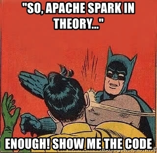
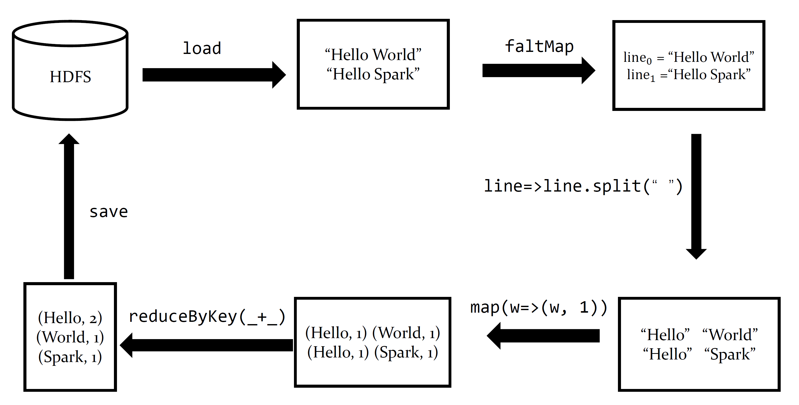

# 实验三 Spark



## 0. 提醒事项

本次实验过程中，请大家完成任务后，一定记得及时使用`:quit` 命令退出 spark-shell。  

服务器资源不足时会导致其他同学任务失败：例如出现`WARN TaskSchedulerImpl: Initial job has not accepted any resources; check your cluster UI to ensure that workers are registered and have sufficient resources` 的报错提醒（此种情况需群里艾特助教清理僵尸进程或者重启 spark）

## 一、实验目标

本次实验旨在使用Spark 处理数据并实现机器学习算法。具体如下：

* 学习使用Spark-shell 基本命令（1 分）；
* 使用Spark 实现词频统计、Top-K统计，并理解分区与并行度对性能的影响（4 分）；
* 使用Spark 实现线性回归训练算法（5 分）。
* Bonus：分析spark中使用cache/persist或分区调节带来的性能变化（2 分）。

参考资料

* RDD Programming Guide https://spark.apache.org/docs/latest/rdd-programming-guide.html
* Spark https://www.usenix.org/system/files/conference/nsdi12/nsdi12-final138.pdf

## 二、学习Spark-shell常用指令

### 基本功能介绍

Spark-shell 是一个强大的交互式分析数据工具，同时也是一种学习Spark的有效工具，它可以使用Scala或Python编写，本课程主要介绍Scala。开启spark-shell：

```bash
2020214210@thumm01:~$ spark-shell
Setting default log level to "WARN".
To adjust logging level use sc.setLogLevel(newLevel). For SparkR, use setLogLevel(newLevel).
Spark Context Web UI is available at Spark Master Public URL
Spark context available as 'sc' (master = spark://thumm01:7077, app id = app-20211017105714-0002).
Spark session available as 'spark'.
Welcome to
      ____              __
     / __/__  ___ _____/ /__
    _\ \/ _ \/ _ `/ __/  '_/
   /___/ .__/\_,_/_/ /_/\_\   version 2.4.4
      /_/

Using Scala version 2.12.8 (Java HotSpot(TM) 64-Bit Server VM, Java 1.8.0_221)
Type in expressions to have them evaluated.
Type :help for more information.

scala>
```

Spark-shell 除了可以使用[Scala 语言](https://docs.scala-lang.org/zh-cn/)操作外，还有一些基本指令，这些指令都以 `:`  开头，指令的用法可以使用`:help` 查看：

```scala
scala> :help
All commands can be abbreviated, e.g., :he instead of :help.
:completions <string>    output completions for the given string
:edit <id>|<line>        edit history
:help [command]          print this summary or command-specific help
:history [num]           show the history (optional num is commands to show)
:h? <string>             search the history
:imports [name name ...] show import history, identifying sources of names
:implicits [-v]          show the implicits in scope
:javap <path|class>      disassemble a file or class name
:line <id>|<line>        place line(s) at the end of history
:load <path>             interpret lines in a file
:paste [-raw] [path]     enter paste mode or paste a file
:power                   enable power user mode
:quit                    exit the interpreter
:replay [options]        reset the repl and replay all previous commands
:require <path>          add a jar to the classpath
:reset [options]         reset the repl to its initial state, forgetting all session entries
:save <path>             save replayable session to a file
:sh <command line>       run a shell command (result is implicitly => List[String])
:settings <options>      update compiler options, if possible; see reset
:silent                  disable/enable automatic printing of results
:type [-v] <expr>        display the type of an expression without evaluating it
:kind [-v] <type>        display the kind of a type. see also :help kind
:warnings                show the suppressed warnings from the most recent line which had any
```

其中，常用指令为：

* `:quit` 退出spark-shell控制台；
* `:load <path>` 加载使用scala编写的spark-shell脚本；
* `:save <path>` 将当前上下文的历史指令保存为文件。

### 使用`:load`打印Hello Word（1 分）

在ubuntu自己的目录下新建一个Scala文件，写入`println("HelloWorld!")`，在此目录下进入`spark-shell`使用`:load <path>`运行该文件。（本题 1 分）

## 三、使用Spark 进行词频统计

本部分共 4 分：基础 WordCount 1.5 分，Top-K 高频词统计 0.5 分，分区与并行度对比 1 分，RDD组合与性能分析 1 分。

#### 1. map+reduceByKey（1.5分）

本题请同学们使用自己的数据集，这里需要**先将数据集传入Hadoop文件系统**（见实验二）。请将输出结果放入实验报告

首先，进入spark-shell

```bash
2020214210@thumm01 :~$ spark-shell
```

接下来，我们需要加载待统计词频的数据集，输入以下内容：

```scala
scala> val words = sc.textFile("/dsjxtjc/2020214210/wc_dataset.txt")
words: org.apache.spark.rdd.RDD[String] = /dsjxtjc/2020214210/wc_dataset.txt MapPartitionsRDD[1] at textFile at <console>:24
```

这句命令中, `sc`（Spark-Context）是spark-shell的上下文，这个变量是进入spark-shell就有的，可以用来设置一些运行参数；`val words` 是定义一个变量名为words的变量，它的值是使用`sc.textFile` 函数加载HDFS 中words.txt文件的内容。接下来查看words的内容：

```scala
scala > words.first() # 查看第一行
res0: String = chapter
scala > words.count() # 查看行数
res1: Long = 2683500
```

使用一行代码统计词频：

```scala
scala > val result = words.flatMap(l => l.split(" ")).map(w => (w, 1)).reduceByKey(_ + _)
result: org.apache.spark.rdd.RDD[(String , Int)] = ShuffledRDD [4] at reduceByKey at <console>:25
scala > result.first() # 查看结果的第一行内容
res3: (String, Int) = (someone, 100)
scala > result.saveAsTextFile("/dsjxtjc/2020214210/wc_output")
```

接下来我们来解释这行代码，代码的流程如下图所示，可分为以下步骤：

* 对`words` 逐行处理，对每一行按空格进行分割，得到一个字符串列表；
* 使用`map` 将字符串列表转成一个键值对列表`[<key1, value1>, <key2, value2>, ⋯⋯]`, 其中键为单词，值为词频（没有合并之前为1）；
* 将不同的键值对根据相同的键不断地合并，直至无法合并，得到词频统计结果；
* 将结果保存到HDFS 中(保存到了`/dsjxtjc/student_id/wc_output`)。



#### 2. Top-K实现（0.5分）

请在基础 WordCount 的结果上继续处理，输出 Top-10 高频词，结果格式为`(word, count)`，按词频从高到低排序。推荐使用下面几类RDD操作组合完成：

* 使用`aggregateByKey`或`combineByKey`完成词频聚合；
* 使用`sortBy`按词频排序；
* 使用`take(10)`取出Top-10结果。

请在报告中给出关键代码和Top-10输出截图，并简要说明`take(10)`为什么会触发Spark任务执行。

#### 3. 分区与并行度对比（1分）

同一个WordCount任务在不同分区数下会有不同的并行度和调度开销。请分别使用下面的方式读取同一个HDFS数据集，并记录每次完整WordCount的运行时间：

```scala
val words1 = sc.textFile("/dsjxtjc/学号/wc_dataset.txt", minPartitions = 1)
val words4 = sc.textFile("/dsjxtjc/学号/wc_dataset.txt", minPartitions = 4)
val words16 = sc.textFile("/dsjxtjc/学号/wc_dataset.txt", minPartitions = 16)
val words64 = sc.textFile("/dsjxtjc/学号/wc_dataset.txt", minPartitions = 64)
```

请同时在`spark-shell`中输出：

```scala
sc.defaultParallelism
```

报告中需要给出`minPartitions=1/4/16/64`四组耗时，看看哪个耗时最少，并解释原因。

#### 4. RDD组合与性能分析（1分）

请至少选择两种不同RDD组合实现WordCount或Top-K，并测试运行时间，例如：

* `map + reduceByKey`
* `map + aggregateByKey`
* `map + combineByKey`
* `map + countByKey`

注意：`countByKey`会把结果收集到Driver端，数据量较大时可能带来Driver内存压力。请在报告中说明你选择的实现方式、耗时对比，以及哪一步可能发生shuffle。

* 时间：`var t = new Date().getTime`

## 四、Spark 机器学习

请生成自己的数据集，利用Spark实现线性回归。禁止使用任何MLlib库函数。（本题 5 分）

1. 一元线性回归给 2 分；

2. 多元线性回归（非向量运算，即使用循环更新参数）给 3 分；

3. 向量表示的多元线性回归给 5 分。

提示：

* 线性回归 https://zhuanlan.zhihu.com/p/72513104
* 循环实现和向量实现 https://zhuanlan.zhihu.com/p/154015989
* 以上三点为三种实现方式，实现任意一种即可
* 可以包括矩阵加法、矩阵减法、矩阵乘法、矩阵转置等接口；
* 需要截图放出每一轮的loss，如果训练轮次太多，不一定要全部截图，只需要展示它在下降即可；

## 五、Bonus：Spark 性能优化（2 分）

完成以下任一方向即可获得Bonus。报告中需要给出优化前后的命令行运行时间、关键输出和原因分析。

1. 使用`cache`或`persist`优化迭代式线性回归。请比较缓存训练数据前后的每轮耗时或总耗时，并说明原因。
2. 调节RDD分区数优化WordCount或线性回归。请比较不同partition数量下的运行时间，并结合分区数、RDD依赖关系和命令行日志说明并行度、shuffle和任务调度开销的变化。

可使用以下命令或代码辅助分析：

```scala
// 查看RDD分区数
rdd.getNumPartitions

// 查看RDD依赖关系，观察是否出现ShuffledRDD等信息
rdd.toDebugString

// 记录运行时间
var t1 = new java.util.Date().getTime
// action，例如 count / collect / take / saveAsTextFile
var t2 = new java.util.Date().getTime
println(s"time = ${t2 - t1} ms")
```

## 六、报告提交要求

请严格按照以下要求提交实验报告。

1. 将命令、关键代码（文本）、结果截图放入报告，实验报告需为pdf 格式，连同代码文件一同打包成压缩文件（命名为`学号_姓名_实验三.*`，例如：`2021200000_张三_实验三.zip`），最后提交到网络学堂。压缩文件中文件目录应为：

   ```
   .
   └── 学号_姓名_实验三.pdf
   └── code
       └── code_file1.py
       └── code_file2.py
       └── ...
   ```

2. 迟交作业一周以内，以50% 比例计分；一周以上不再计分。一经发现抄袭情况（包括往届），零分处理。

