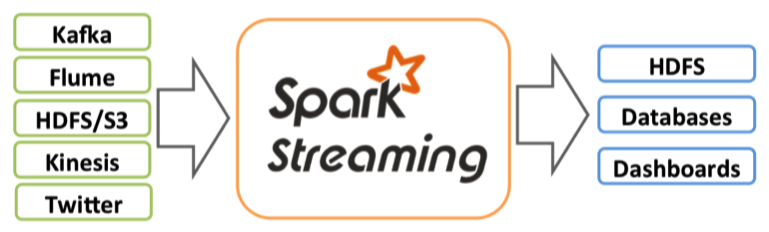
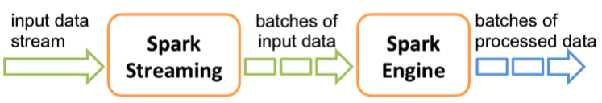
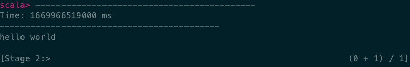
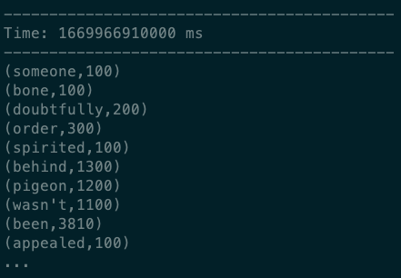

# 实验四 Spark Streaming

# 0. 注意事项

本次实验中请大家使用完成 spark-shell 之后及时使用 `:quit` 命令退出～

## 一、实验目标

本次实验旨在帮助理解实时数据流处理方法。具体如下：

* 学习Spark Streaming分布式处理框架，理解流式数据处理概念；
* 实现简单流式数据产生、接收与处理。

## 二、Spark Streaming概述

Spark Streaming 是核心 Spark API 的扩展，可实现可扩展、高吞吐量、可容错的实时数据流处理。数据可以从诸如 Kafka，Flume，Kinesis 或 TCP 套接字等众多来源获取，并且可以使用由高级函数（如 map，reduce，join 和 window）开发的复杂算法进行流数据处理。最后，处理后的数据可以被推送到文件系统，数据库和实时仪表板。而且，还可以在数据流上应用 Spark 提供的机器学习和图处理算法。



在内部，它的工作原理如图所示。Spark Streaming 接收实时输入数据流，并将数据切分成批，然后由 Spark 引擎对其进行处理，最后生成“批”形式的结果流。Spark Streaming 将连续的数据流抽象为 discretized stream 或 DStream。可以从诸如 Kafka，Flume 和 Kinesis 等来源的输入数据流中创建 DStream，或者通过对其他 DStream 应用高级操作来创建。在内部，DStream 由一个 RDD 序列表示。



## 三、流式数据产生、接收与处理

### 1. 使用 netcat 指令产生测试数据流（2分）

netcat 是网络工具中的瑞士军刀，它能通过 TCP 和 UDP 在网络中读写数据。通过 与其他工具重定向，可以实现很多复杂的功能，如端口扫描、流式数据生成或保存、文件传输等。本次实验主要用 netcat 生成流式数据。

首先，我们需要开启两个终端，一个用于生成流式数据，另一个用于接收流式数据。在 两个窗口中分别执行下面的指令（把 11009 改成学号的后四位或五位，避免端口冲突）

```shell
# terminal_1
thumm01:~$ nc -lk 11009

# terminal_2 
thumm01:~$ nc localhost 11009
```

接着输入字符串，这个字符串会被这一端的 netcat 以流数据的形式发送到 对应的端口，并在另一端被 netcat 接收并输出。这是一个最简单的聊天软件:)

```shell
# terminal_2
thumm01:~$ nc localhost 11009
Hello World

# terminal_1
thumm01:~$ nc -lk 11009
Hello World
```

此外，netcat 还可以与重定向符号”>”结合直接将文件数据转成网络流发送到另一端

```shell
# terminal_1
thumm01:~$ nc -lk 11009 
spark streaming test

# terminal_2
thumm01:~$ vim test.txt 
thumm01:~$ cat test.txt 
spark streaming test 
thumm01:~$ nc localhost 11009 < test.txt
```

如果右边改成 `nc -lk 11009 > test_recvd.txt` 就可以把接受的流保存成文件，完成了一次文件传输

### 2. 使用 Spark Streaming 接收流数据（2分）

前面使用了 netcat 接收流数据并打印，接下来使用 SparkStream 接收流数据，为后续流数据处理做准备。首先使用 netcat 交互地生成流式数据

```shell
thumm01:~$ nc -lk 11009
```

然后在另一个终端启动 spark-shell

```scala
thumm01:~$ spark-shell 
//spark-shell 启 动 信 息

// 导 入 相 关 SparkStreaming 包 
scala> import org.apache.spark.streaming.{Seconds, StreamingContext} 
import org.apache.spark.streaming.{Seconds, StreamingContext}

// 创 建 流 式 
scala> val ssc = new StreamingContext(sc, Seconds(1)) 
ssc: org.apache.spark.streaming.StreamingContext = org.apache.spark.streaming.StreamingContext@2114955c 

// 监听 thumm01 的 11009 端口 
scala> val lines = ssc.socketTextStream("thumm01", 11009) 
lines: org.apache.spark.streaming.dstream.ReceiverInputDStream[String] = org.apache.spark.streaming.dstream.SocketInputDStream@105fa381 

scala> lines.print() // 打 印 接 收 到 的 信 息 
scala> ssc.start() // 启 动 流 数 据 接 受 与 处 理 
... // 每 隔 一 段 时 间 刷 新 一 次 , 如 果 接 收 到 信 息 就 输 出 ， 没 有 接 受 就 只 输 出 时 间 
scala> ssc.stop () // 停 止 流 数 据 接 收
```

在 netcat 端输入 “hello world”, 回车，在 spark-shell 端会出现下面的输出，表示接收到信息:



Spark Streaming 需要输入 ssc.stop() 停止流数据的接收，而 ctrl + c 不会让程序退出， 这点需要注意。从上面的流程，我们可以看到 Spark Streaming 处理流式数据的过程是先定义处理流程，然后启动任务。

### 3. 使用 Spark Streaming 做词频统计（3分）

当我们能接收到流数据以后，下一步就是对流数据进行处理，这里还是做最经典的词频统计任务。在一个终端启动 spark-shell，输入下面指令

```scala
import org.apache.spark.streaming._ // 导 入 数 据 包 
val ssc = new StreamingContext(sc, Seconds(5)) // 创 建 流 数 据 上 下 文 ， 每隔 5 秒 创 建 一 个 流 式 RDD
val lines = ssc.socketTextStream("thumm01", 11009) // 监听 thumm01 的端口 
val result = lines.flatMap(_.split(" " )).map(w => (w, 1)).reduceByKey(_ + _) // 词 频 统 计 
result.print() // 输 出 词 频 统 计 结 果 
ssc.start() // 启 动 任 务 // 
ssc.stop() 最 后 退 出 的 时 候 输 入
```

在指令执行过程中，程序会输出很多错误，这个可以不用管，因为生成流数据的那端还没开。

在另一个终端产生数据，这里使用 netcat 将 wc_dataset.txt 作为数据源生成流：

```shell
thumm01:~$ nc -l 11009 < /home/dsjxtjc/wc_dataset.txt
```

这个时候，Spark Streaming 端就会显示词频统计的结果：



这个时候我们就完成了统计 5 秒内词频的功能， 对这个程序做一定的修改， 就能实现统计累计词频的功能。
### 4. 窗口词频统计 / 累计词频统计（3分）

上一题统计的是每个 micro-batch 内的词频，也就是每 5 秒只统计一次当前批次收到的数据。请在此基础上实现更符合流式处理特点的统计方式，完成下面两项中的任意一项即可：

1. **窗口词频统计**：使用 `reduceByKeyAndWindow` 统计最近一段时间窗口内的词频。例如每 10 秒统计过去 30 秒内的词频，并输出结果；
2. **累计词频统计**：使用 `updateStateByKey` 维护从任务启动以来每个单词的累计出现次数。

如果选择累计词频统计，需要设置 checkpoint 目录，例如：

```scala
ssc.checkpoint("xx位置")
```

请在报告中给出关键代码、输入数据示例和连续多个批次的输出截图，并说明你的程序统计的是“当前批次词频”“窗口词频”还是“累计词频”。实验结束时请使用：

```scala
ssc.stop(stopSparkContext = false, stopGracefully = true)
```

停止流式任务，然后使用 `:quit` 退出 `spark-shell`，避免占用服务器资源。

## 四、报告提交要求

请严格按照以下要求提交实验报告。

1. 将命令、关键代码（文本）、结果截图放入报告，实验报告需为pdf 格式，连同代码文件一同打包成压缩文件（命名为`学号_姓名_实验一.*`，例如：`2025200000_张三_实验一.zip`），最后提交到网络学堂。压缩文件中文件目录应为：

   ```
   .
   └── 学号_姓名_实验二.pdf
   └── code
       └── code_file1.py
       └── code_file2.py
       └── ...
   ```

2. 迟交作业一周以内，以50% 比例计分；一周以上不再计分。另一经发现抄袭情况（包括往届），零分处理。
